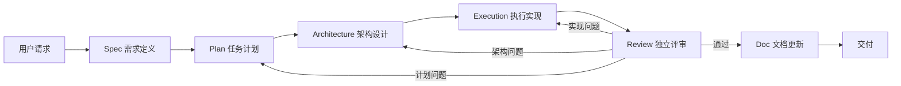

# Multi-Agent Pipeline

> 面向 Claude Code / Codex 工作流的多智能体生产流水线技能。  
> 把一次复杂实现拆成 **需求澄清 → 计划 → 架构 → 执行 → 评审 → 文档** 六个阶段，并用结构化产物把每一步沉淀下来。

<p align="center">
  <strong>让复杂实现不再靠一次性提示词硬扛，而是像工程流水线一样被拆解、验证和交付。</strong>
</p>

---

## 目录

- [这个项目是什么](#这个项目是什么)
- [适合什么时候使用](#适合什么时候使用)
- [工作流一览](#工作流一览)
- [核心特性](#核心特性)
- [目录结构](#目录结构)
- [快速开始](#快速开始)
- [六个阶段如何协作](#六个阶段如何协作)
- [产物说明](#产物说明)
- [评审机制](#评审机制)
- [使用建议](#使用建议)
- [常见问题](#常见问题)

---

## 这个项目是什么

`multi-agent-pipeline` 是一个 Claude Code 技能目录，用于组织非平凡软件工程任务的多智能体协作。

它不是普通的代码生成提示词，而是一套 **生产级交付流程约束**：

- 主智能体只负责调度、保存产物、聚合评审和与用户沟通。
- 子智能体分别负责 Spec、Plan、Architecture、Execution、Review、Doc 等阶段。
- 每个阶段输出严格的 JSON 产物，统一保存在 `.pipeline-workspace/`。
- 执行完成后进入评审；评审失败会按原因回到执行、架构或计划阶段重做。

这让复杂任务从“模型一次性完成”变成“多个角色分工协作、每一步可追踪”。

---

## 适合什么时候使用

### 推荐使用

- 新功能实现，涉及多个文件或模块
- 中大型重构，需要先明确边界和风险
- 需要独立评审的关键改动
- 用户明确要求使用 pipeline / multi-agent / production workflow
- 需要把需求、计划、架构、执行和文档更新都沉淀为可检查产物

### 不建议使用

- 修一个错别字
- 单文件小改动
- 纯问答或代码解释
- 用户明确希望快速直接打补丁

---

## 工作流一览



默认评审模式为 **EME**：三个独立 Review 智能体并行评审，通过多数投票聚合结论。

---

## 核心特性

| 能力 | 说明 |
|---|---|
| 阶段化交付 | 把复杂实现拆成 Spec、Plan、Architecture、Execution、Review、Doc 六个阶段 |
| 结构化产物 | 每个阶段输出 JSON，便于检查、复用和追踪 |
| 主从分工 | 主智能体只做调度，具体实现和评审交给子智能体 |
| 独立评审 | 支持 PRE 单评审和 EME 三评审多数投票 |
| 自动返工路由 | 评审失败后可回到 Execution、Architecture 或 Plan |
| 工作区沉淀 | 所有 canonical artifact 保存到 `.pipeline-workspace/` |
| 文档闭环 | 评审通过后进入 Doc 阶段，更新必要文档和 CHANGELOG |

---

## 目录结构

```text
multi-agent-pipeline/
├── SKILL.md                         # 技能入口与主流程说明
├── README.md                        # 面向用户的中文说明文档
├── agents/
│   ├── spec.md                      # Spec 阶段提示词
│   ├── plan.md                      # Plan 阶段提示词
│   ├── architecture.md              # Architecture 阶段提示词
│   ├── execution.md                 # Execution 阶段提示词
│   ├── review.md                    # Review 阶段提示词
│   └── doc.md                       # Doc 阶段提示词
└── references/
    ├── contracts.md                 # 所有 JSON 产物契约
    ├── pre-rubric.md                # PRE / EME 评审标准
    └── orchestrator-prompts.md      # 调度器提示词模板
```

运行流水线时，调度器会创建并维护：

```text
.pipeline-workspace/
├── spec.json
├── plan.json
├── architecture.json
├── execution-report.json
├── review_feedback.json
├── doc-report.json
├── review_history/
└── logs/
```

---

## 快速开始

在 Claude Code 或兼容的 Codex 工作流中，描述你的实现目标，并明确要求使用该技能即可。

示例：

```text
请使用 multi-agent-pipeline，为这个项目实现用户登录后的审计日志功能。
要求：
- 记录用户 ID、动作、时间和来源 IP
- 加测试
- 通过评审后更新文档
```

流水线会按以下顺序推进：

1. 生成 `spec.json`，明确需求、约束和验收标准。
2. 生成 `plan.json`，拆分阶段、任务和依赖顺序。
3. 生成 `architecture.json`，读取真实代码并决定改动方案。
4. 由 Execution worker 实现改动并输出 `execution-report.json`。
5. Review 智能体按 8 个维度独立评审。
6. 评审通过后进入 Doc 阶段，更新文档并输出 `doc-report.json`。

---

## 六个阶段如何协作

### 1. Spec：把需求变成可验收契约

Spec 阶段负责把自然语言请求整理成 `spec.json`。

它会明确：

- 功能目标
- 需求列表
- 验收标准
- 约束条件
- 非目标范围
- 合理假设

目标是让后续阶段不再猜测“用户到底要什么”。

### 2. Plan：把需求拆成执行顺序

Plan 阶段基于 `spec.json` 输出 `plan.json`。

它关注：

- 阶段划分
- 任务拆分
- 任务依赖
- 执行顺序
- 风险与缓解策略

Plan 不负责设计代码结构，架构决策交给 Architecture 阶段。

### 3. Architecture：读取真实代码后设计方案

Architecture 阶段会实际检查代码库，输出 `architecture.json`。

它会判断本次改动属于：

- `incremental`：小步增量改动
- `refactor`：结构性重构
- `hybrid`：混合方案

并给出具体文件级别的 `proposed_changes`。

### 4. Execution：按架构边界实现

Execution worker 负责真正修改代码。

它只能修改 `architecture.json` 中授权的文件，以及必要的相邻测试或文档。实现完成后输出 `execution-report.json`，说明：

- 改了哪些文件
- 覆盖了哪些需求
- 跑了哪些测试
- 是否存在阻塞

### 5. Review：严格评审并决定是否返工

Review 阶段按 PRE 标准检查 8 个维度：

1. Correctness
2. Security
3. Performance
4. Error Handling
5. Code Quality
6. Architecture Compliance
7. Test Coverage
8. Backward Compatibility

默认 EME 模式会启动 3 个独立 reviewer。任何失败都会被聚合进 `review_feedback.json`，并决定下一步回到 Execution、Architecture 或 Plan。

### 6. Doc：通过评审后补齐文档

Doc worker 在评审通过后运行，负责更新真正需要变化的文档。

默认规则：

- 总是更新 `CHANGELOG.md`
- 用户可见行为或安装方式变化时更新 `README.md`
- API 或接口变化时更新 API 文档

---

## 产物说明

| 文件 | 生产阶段 | 用途 |
|---|---|---|
| `spec.json` | Spec | 需求、验收标准、约束和范围 |
| `plan.json` | Plan | 阶段、任务、依赖和执行顺序 |
| `architecture.json` | Architecture | 代码库分析、架构决策和目标文件 |
| `execution-report.json` | Execution | 实现结果、测试记录和阻塞信息 |
| `review_feedback.json` | Review | 评审聚合结果、失败原因和返工方向 |
| `doc-report.json` | Doc | 文档更新结果和说明 |
| `review_history/` | Review | 每个 reviewer 的独立评审记录 |

这些文件让流水线具备可审计性：你可以随时回看每一步为什么这么做、失败在哪里、下一步应该去哪里。

---

## 评审机制

### PRE：单点评审

PRE 使用一个 reviewer，适合小范围改动或需要节省时间和成本的情况。

### EME：三点评审

EME 使用三个 reviewer 独立评审，然后按维度投票聚合。默认使用 EME，因为它更适合生产级变更。

| 评分 | 含义 |
|---|---|
| `pass` | 满足要求，没有发现问题 |
| `warning` | 有轻微问题，但不阻塞交付 |
| `fail` | 存在必须修复的阻塞问题 |

`warning` 在多数投票中按通过处理，但会被保留在最终反馈里。

---

## 使用建议

### 写好初始请求

好的请求应该包括：

- 你要实现什么
- 哪些行为必须满足
- 哪些范围不要碰
- 是否需要测试、文档或浏览器验证
- 是否有性能、安全或兼容性约束

示例：

```text
使用 multi-agent-pipeline 实现导出 CSV 功能。
约束：
- 不改变现有 API
- 大数据量时不能一次性加载全部记录
- 需要覆盖权限失败和空数据场景
- 通过评审后更新 README 和 CHANGELOG
```

### 让流水线处理复杂度

除非存在真正阻塞的问题，否则 Spec 阶段会把低风险不确定性写成假设并继续推进。这样可以避免流程因为小问题频繁停顿。

### 重视评审反馈

如果评审失败，失败并不代表流程失效。它会把问题路由到正确层级：

- 实现写错了：回 Execution
- 架构方案不够好：回 Architecture
- 计划拆分或顺序有问题：回 Plan

---

## 常见问题

### 这是一个通用 Agent 框架吗？

不是。它是为 Claude Code / Codex 风格的工程交付设计的技能工作流，重点是本地调度、结构化产物和阶段化质量门。

### 为什么主智能体不直接写代码？

为了减少主上下文膨胀，并让职责更清晰。主智能体负责调度和决策，Execution worker 才是实现负责人，Review worker 才是质量判断负责人。

### 为什么需要 JSON 产物？

JSON 产物让每个阶段的输入输出稳定、可验证、可追踪，也方便失败后把上下文传给上游阶段重做。

### 评审失败会无限循环吗？

不会。正常的 Execution → Review 失败循环连续出现 2 次后，会强制回到 Architecture 重新检查方案，而不是让执行阶段盲目反复修改。

### 文档一定会更新吗？

Doc 阶段总是检查文档需求，并按规则更新真正需要变动的文档。`CHANGELOG.md` 是默认必须更新的文档。

---

## 一句话总结

`multi-agent-pipeline` 把复杂软件实现变成一条可追踪、可评审、可返工的工程流水线：先把需求说清楚，再计划，再设计，再执行，再评审，最后补齐文档。
