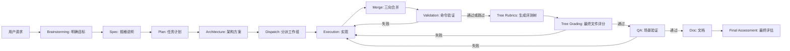

# 多智能体流水线

`multi-agent-pipeline` 是一套 Codex-first 的复杂开发任务流程。它把较大的工作拆成需求、计划、架构、分派、实现、合并、验证、Tree Rubrics 评分、QA、文档和最终评估，让每一步都有明确责任和可追踪产物。

它适合新功能、跨文件重构、需要严格验证的改动，或你明确要求使用“流水线”“多智能体”“production workflow”的场景。小修小补、纯问答、单文件快速修改通常不需要走完整流水线。

## 怎么启动

在 Codex 里直接说明要用这个技能或多智能体流水线即可：

```text
使用 multi-agent-pipeline 给 API 加一个限速功能
```

```text
用多智能体流水线把登录模块改造成支持第三方账号登录
```

默认质量门禁是 Tree Rubrics：先生成树状评测标准，再由 3 个独立评分员只基于最终输出文件逐节点评分。

## 流程一览


```mermaid
flowchart LR
    A["用户请求"] --> B["Brainstorming: 明确目标"]
    B --> C["Spec: 规格说明"]
    C --> D["Plan: 任务计划"]
    D --> E["Architecture: 架构方案"]
    E --> F["Dispatch: 分派工作组"]
    F --> G["Execution: 实现"]
    G --> H["Merge: 三向合并"]
    H --> I["Validation: 命令验证"]
    I -->|通过或跳过| J["Tree Rubrics: 生成评测树"]
    I -->|失败| G
    J --> K["Tree Grading: 最终文件评分"]
    K -->|通过| L["QA: 场景验证"]
    K -->|失败| G
    L -->|通过| M["Doc: 文档"]
    L -->|失败| G
    M --> N["Final Assessment: 最终评估"]
```

## 主要能力

| 能力 | 说明 |
|---|---|
| Codex 子代理 | 使用 `spawn_agent`/`wait_agent` 运行各阶段，默认固定为 `gpt-5.5`、`xhigh` 推理、`priority` service tier |
| 显式记录 | 关键产物写入 `.pipeline-workspace/`，成功验收后保留 `.pipeline-last-run-summary.json` |
| 分组实现 | Dispatch 按文件所有权和依赖拆分 worker group，减少并行冲突 |
| 保守合并 | Merge 由 orchestrator 本地执行，使用三向合并语义，冲突时暂停给人处理 |
| 多语言验证 | Validation 根据项目标记自动选择 Go、Python、JavaScript/TypeScript、Rust、Java、Ruby 的 fix/check 命令 |
| Tree Rubrics 评分 | 每个 group 生成分类、初版 rubric、验证结果和 refined rubric，再对最终输出文件评分 |
| 端到端评分 | Tree Grading 只看 `spec`、`tree_rubrics_refined.json` 和 `final-output-files.json`，不看过程日志或 agent 行为 |
| Codex pet 事件 | Runtime 会输出 `codex_pet_events`，把 pipeline 阶段映射到 `running`、`review`、`failed`、`waiting`、`waving` 等 Codex avatar state |

## 文件结构

```text
skills/multi-agent-pipeline/
├── SKILL.md
├── agents/
│   ├── spec.md
│   ├── plan.md
│   ├── architecture.md
│   ├── dispatch.md
│   ├── execution.md
│   ├── validation.md
│   ├── tree-classification.md
│   ├── tree-rubric-generation.md
│   ├── tree-rubric-verification.md
│   ├── tree-rubric-refinement.md
│   ├── tree-grading.md
│   ├── qa.md
│   ├── doc.md
│   └── final-assessment.md
├── references/
│   ├── contracts.md
│   ├── pre-rubric.md
│   ├── orchestrator-prompts.md
│   └── example-run.md
├── src/runtime/
└── test/
```

运行时工作区大致如下：

```text
.pipeline-workspace/
├── spec.json
├── plan.json
├── architecture.json
├── dispatch.json
├── execution/
├── complexity/
├── merge/
├── validation/
├── tree_rubrics/
├── final_outputs/
├── grading_history/
├── qa/
├── assessment_history/
└── logs/
```

## Tree Rubrics 门禁

每个 worker group 合并并通过 Validation 后，流水线会运行四个 rubric 生成阶段：

| 阶段 | 产物 |
|---|---|
| Classification | `classification.json` |
| Generation | `tree_rubrics.json` |
| Verification | `validation_result.json` |
| Refinement | `tree_rubrics_refined.json` |

随后 orchestrator 本地生成 `final-output-files.json`，范围是该 group 的 `changed_files ∪ owned_files`。3 个 grader 并行产出 `tree_grading_individual_N.json`，orchestrator 聚合为 `tree_grading_feedback.json`。

评分规则：

| 规则 | 说明 |
|---|---|
| 节点评分 | 每个节点由 3 个 grader 多数投票得到 0/1 |
| 深度权重 | depth 1 权重 1，depth 2 权重 2，depth 3+ 权重 3 |
| 依赖链 | 同一 branch 内浅层节点失败时，更深层节点 effective score 自动为 0 |
| 通过门槛 | `weighted_score >= 0.80` 且所有 depth 1 节点通过 |

## 安装到 Codex

如果要把仓库里的 skill 同步到当前 Codex 环境，可以把 `skills/multi-agent-pipeline/` 同步到：

```text
~/.codex/skills/multi-agent-pipeline/
```

同步后需要重启 Codex 才能让新的 skill 指令在后续会话中稳定生效。
