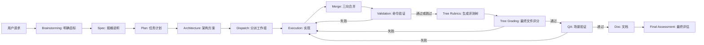

# 多智能体流水线

`multi-agent-pipeline` 是一套 Codex-compatible、OpenCode-adaptable 的复杂开发任务流程。它把较大的工作拆成需求澄清、计划、架构、分派、实现、复杂度检查、合并、验证、Tree Rubrics 评分、QA、文档和最终评估，让每一步都有明确责任和可追踪产物。

它适合新功能、跨文件重构、需要严格验证的改动，或你明确要求使用“流水线”“多智能体”“production workflow”的场景。小修小补、纯问答、单文件快速修改通常不需要走完整流水线。

## 怎么启动

在 Codex 里直接说明要用这个技能或多智能体流水线即可：

```text
使用 multi-agent-pipeline 给 API 加一个限速功能
```

```text
用多智能体流水线把登录模块改造成支持第三方账号登录
```

默认质量门禁是 Tree Rubrics：先生成树状评测标准，再由 3 个独立评分员只基于最终输出文件逐节点评分。

在 OpenCode 里，把 skill 目录安装到 `.opencode/skills/multi-agent-pipeline/` 或 `~/.config/opencode/skills/multi-agent-pipeline/`，再用 `templates/opencode-expert-agent.md` 创建一个 `.opencode/agents/multi-agent-pipeline-expert.md` primary agent。OpenCode 会先通过 `name` 和 `description` 发现技能，真正匹配复杂实现任务时再用原生 `skill` tool 加载 `SKILL.md`。

## 流程一览


```mermaid
flowchart LR
    A["用户请求"] --> B["Brainstorming: 明确目标"]
    B --> C["Spec: 规格说明"]
    C --> D["Plan: 任务计划"]
    D --> E["Architecture: 架构方案"]
    E --> F["Dispatch: 分派工作组"]
    F --> G["Execution: 实现"]
    G --> H["Merge: 三向合并"]
    H --> I["Validation: 命令验证"]
    I -->|通过或跳过| J["Tree Rubrics: 生成评测树"]
    I -->|失败| G
    J --> K["Tree Grading: 最终文件评分"]
    K -->|通过| L["QA: 场景验证"]
    K -->|失败| G
    L -->|通过| M["Doc: 文档"]
    L -->|失败| G
    M --> N["Final Assessment: 最终评估"]
```

## 主要能力

| 能力 | 说明 |
|---|---|
| Codex 子代理 | 使用 `spawn_agent`/`wait_agent` 运行各阶段，默认固定为 `gpt-5.5`、`xhigh` 推理、`priority` service tier |
| OpenCode 专家模式 | 通过自定义 primary agent 和原生 `skill` tool 进行渐进式披露，Task/subagent 调用细节放在 OpenCode adapter 中 |
| 显式记录 | 关键产物写入 `.pipeline-workspace/`，成功验收后保留 `.pipeline-last-run-summary.json` |
| 分组实现 | Dispatch 按文件所有权和依赖拆分 worker group，每个执行 wave 最多 6 组，并尽量把安全并发打满到 6 |
| 全局槽位池 | Execution、Validation、Tree Rubrics、Tree Grading、QA 共享 6 个子代理槽位，完成的 group 可在有槽位时提前进入后续阶段 |
| 保守合并 | Merge 由 orchestrator 本地执行，使用三向合并语义，冲突时暂停给人处理 |
| 多语言验证 | Validation 根据项目标记自动选择 Go、Python、JavaScript/TypeScript、Rust、Java、Ruby 的 fix/check 命令 |
| 产物模板 | 每个 stage 有 `templates/artifacts/` JSON 骨架，runtime 会先填确定字段再交给 contract validator |
| Git 自动发布 | 可选 `gitPolicy` 让 Doc/Cleanup 阶段由 orchestrator 自动生成 gitmoji + Conventional Commits 中文提交并按策略 push |
| Tree Rubrics 评分 | 每个 group 生成分类、初版 rubric、验证结果和 refined rubric，再对最终输出文件评分 |
| 端到端评分 | Tree Grading 只看 `spec`、`tree_rubrics_refined.json` 和 `final-output-files.json`，不看过程日志或 agent 行为 |
| Codex pet 事件 | Runtime 会输出 `codex_pet_events`，把 pipeline 阶段映射到 `running`、`review`、`failed`、`waiting`、`waving` 等 Codex avatar state |

## 并发与早续流转

Dispatch 的每个执行 wave 最多包含 6 个 worker group。它会优先保留安全拆分，尽量把并发扩展到 6；如果同一依赖层里有超过 6 个互不冲突的独立组件，会按模块亲缘、功能区域、运行时表面、测试表面或所需 skill 把多出来的组件合并到相近 group。它不会为了凑满 6 个槽位而把有文件重叠或强耦合的任务硬拆开。

Execution、Validation、Tree Rubrics、Tree Grading 和 QA 共享一个全局 6 槽子代理池。一个 group 完成 Execution 并成功合并后，只要有槽位就可以立即进入 Validation；Validation 通过后也可以继续进入 Tree Rubrics、Tree Grading 和 QA，不需要等待同一 execution wave 里的其他 group 全部完成。Tree Grading 默认一次占用 3 个槽位来启动 3 个独立 grader，必须等 3 个槽位都空出来后再一起启动。

重试保持同组优先：Validation、Tree Grading 或 QA 发现的问题如果能在原 group 的 owned files 或相邻测试/文档内修复，就回到 Execution 做同组 retry。若修复需要未授权文件、跨 group 所有权变化或重新拆分任务，Execution 必须以 `REPLAN_REQUIRED:` blocker 返回，让 orchestrator 回到 Dispatch 重新分派。

## 文件结构

```text
skills/multi-agent-pipeline/
├── SKILL.md
├── agents/
│   ├── spec.md
│   ├── plan.md
│   ├── architecture.md
│   ├── dispatch.md
│   ├── execution.md
│   ├── validation.md
│   ├── tree-classification.md
│   ├── tree-rubric-generation.md
│   ├── tree-rubric-verification.md
│   ├── tree-rubric-refinement.md
│   ├── tree-grading.md
│   ├── qa.md
│   ├── doc.md
│   └── final-assessment.md
├── references/
│   ├── contracts.md
│   ├── codex-execution-model.md
│   ├── opencode-expert-mode.md
│   ├── orchestration-rules.md
│   ├── pre-rubric.md
│   ├── pipeline-stages.md
│   ├── orchestrator-prompts.md
│   ├── workspace-and-events.md
│   └── example-run.md
├── templates/
│   ├── artifacts/
│   │   ├── spec.json
│   │   ├── execution-report.json
│   │   └── ...
│   └── opencode-expert-agent.md
├── src/runtime/
└── test/
```

运行时工作区大致如下：

```text
.pipeline-workspace/
├── spec.json
├── plan.json
├── architecture.json
├── dispatch.json
├── execution/
├── complexity/
├── merge/
├── validation/
├── tree_rubrics/
├── final_outputs/
├── grading_history/
├── qa/
├── assessment_history/
└── logs/
```

## Tree Rubrics 门禁

每个 worker group 合并并通过 Validation 后，流水线会运行四个 rubric 生成阶段：

| 阶段 | 产物 |
|---|---|
| Classification | `classification.json` |
| Generation | `tree_rubrics.json` |
| Verification | `validation_result.json` |
| Refinement | `tree_rubrics_refined.json` |

随后 orchestrator 本地生成 `final-output-files.json`，范围是该 group 的 `changed_files ∪ owned_files`。3 个 grader 并行产出 `tree_grading_individual_N.json`，orchestrator 聚合为 `tree_grading_feedback.json`。

评分规则：

| 规则 | 说明 |
|---|---|
| 节点评分 | 每个节点由 3 个 grader 多数投票得到 0/1 |
| 深度权重 | depth 1 权重 1，depth 2 权重 2，depth 3+ 权重 3 |
| 依赖链 | 同一 branch 内浅层节点失败时，更深层节点 effective score 自动为 0 |
| 通过门槛 | `weighted_score >= 0.80` 且所有 depth 1 节点通过 |

## 渐进式披露

这个 skill 的主入口 `SKILL.md` 现在只保留触发条件、流程图、硬规则和按需读文件路线。详细规则拆在：

| 文件 | 作用 |
|---|---|
| `references/codex-execution-model.md` | Codex `spawn_agent` / `wait_agent` / profile / 并发规则 |
| `references/opencode-expert-mode.md` | OpenCode skill 发现、权限、专家 primary agent 配置 |
| `references/pipeline-stages.md` | 0-11 阶段的详细目标和门禁 |
| `references/workspace-and-events.md` | `.pipeline-workspace/`、summary 和 pet events |
| `references/orchestration-rules.md` | prompt、artifact、review、merge、cleanup 纪律 |

OpenCode 只需要先看到 frontmatter 的 `name` 和 `description`；加载技能后，也应按当前阶段读取对应 reference 或 `agents/<stage>.md`，不要一次性读取整套手册。

## 产物模板

`templates/artifacts/` 保存每个 stage 输出 JSON 的骨架。StageCatalog 会把当前 stage 的模板放进 stage request，PipelineOrchestrator 在 `validateArtifact()` 前会把模型输出、模板和确定性上下文字段合并。

模板只负责结构稳定性和确定字段，例如 `version`、`spec_ref`、`group_id`、`iteration`、固定评分维度和固定 merge strategy。需求、任务、evidence、测试结果、QA 结论和最终验收结论仍然必须由 stage 输出提供，并继续接受 `references/contracts.md` 对应 validator 的校验。

## Git 自动发布

`PipelineOrchestrator` 支持可选 `gitPolicy`。默认不启用，因此普通运行不会执行任何 git 命令；启用后只在 orchestrator 本地阶段发布：

- Doc：文档 proposal 合并成功后提交 `doc-report.updated_files`，默认 `docs(pipeline): :memo: 更新流水线交付文档`，默认不 push。
- Cleanup：最终评估 `accept` 且 `.pipeline-workspace/` 清理完成后提交最终工作树，默认 `feat(pipeline): :sparkles: 完成流水线交付`，默认 push 到 `origin` 当前分支。
- 子 agent 不允许 commit 或 push。提交信息保持 `type(scope): :gitmoji: 中文描述`，兼容 Conventional Commits。

示例：

```js
const orchestrator = new PipelineOrchestrator({
  repoRoot,
  stageRunner,
  gitPolicy: {
    enabled: true,
    remote: "origin",
    doc: { push: true },
    cleanup: { push: true },
  },
});
```

## OpenCode 专家模式

推荐配置：

```text
.opencode/
├── agents/
│   └── multi-agent-pipeline-expert.md
└── skills/
    └── multi-agent-pipeline/
        ├── SKILL.md
        ├── agents/
        ├── references/
        ├── templates/
        ├── scripts/
        ├── src/
        └── test/
```

`templates/opencode-expert-agent.md` 是可复制的 agent 模板。它把 `multi-agent-pipeline` skill 设置为允许加载，并把 Task/subagent、编辑、bash、外部目录访问保持为可控权限。官方 OpenCode 文档把这类配置称为自定义 agent；这里的“专家模式”指这个高能力 primary agent 配置，而不是 OpenCode 内置的固定模式名。

运行时也暴露了 `DEFAULT_OPENCODE_EXPERT_STAGE_PROFILES`，供 OpenCode 适配器把阶段 prompt、references、Task 调用和专家 agent 关联起来。默认 `DEFAULT_STAGE_PROFILES` 仍然指向 Codex profile，保留原来的 Codex 行为。

## 安装到 Codex

如果要把仓库里的 skill 同步到当前 Codex 环境，可以把 `skills/multi-agent-pipeline/` 同步到：

```text
~/.codex/skills/multi-agent-pipeline/
```

同步后需要重启 Codex 才能让新的 skill 指令在后续会话中稳定生效。
