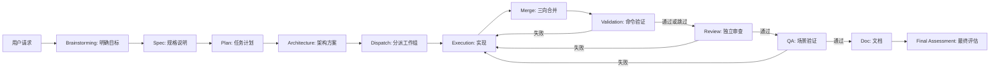

# 多智能体流水线

`multi-agent-pipeline` 是一套 Codex-first 的复杂开发任务流程。它把一件较大的工作拆成需求澄清、计划、架构、分派、实现、合并、验证、审查、QA、文档和最终评估，让每一步都有明确责任和可追踪产物。

它适合新功能、跨文件重构、需要严格验证的改动，或你明确要求使用“流水线”“多智能体”“production workflow”的场景。小修小补、纯问答、单文件快速修改通常不需要走完整流水线。

## 怎么启动

在 Codex 里直接说明要用这个技能或多智能体流水线即可：

```text
使用 multi-agent-pipeline 给 API 加一个限速功能
```

```text
用多智能体流水线把登录模块改造成支持第三方账号登录
```

也可以指定检查偏好：

```text
用 multi-agent-pipeline 做报表 CSV 导出，审查用 PRE
```

默认审查模式是 EME：三个独立 Review 子代理并行检查，然后聚合结果。

## 流程一览


```mermaid
flowchart LR
    A["用户请求"] --> B["Brainstorming: 明确目标"]
    B --> C["Spec: 规格说明"]
    C --> D["Plan: 任务计划"]
    D --> E["Architecture: 架构方案"]
    E --> F["Dispatch: 分派工作组"]
    F --> G["Execution: 实现"]
    G --> H["Merge: 三向合并"]
    H --> I["Validation: 命令验证"]
    I -->|通过或跳过| J["Review: 独立审查"]
    I -->|失败| G
    J -->|通过| K["QA: 场景验证"]
    J -->|失败| G
    K -->|通过| L["Doc: 文档"]
    K -->|失败| G
    L --> M["Final Assessment: 最终评估"]
```

## 主要能力

| 能力 | 说明 |
|---|---|
| Codex 子代理 | 使用 `spawn_agent`/`wait_agent` 运行各阶段，默认继承当前模型和推理设置 |
| 显式记录 | 关键产物写入 `.pipeline-workspace/`，成功验收后保留 `.pipeline-last-run-summary.json` |
| 分组实现 | Dispatch 按文件所有权和依赖拆分 worker group，减少并行冲突 |
| 保守合并 | Merge 由 orchestrator 本地执行，使用三向合并语义，冲突时暂停给人处理 |
| 多语言验证 | Validation 根据项目标记自动选择 Go、Python、JavaScript/TypeScript、Rust、Java、Ruby 的 fix/check 命令 |
| 独立审查 | Review 支持 EME 三审或 PRE 单审，按 8 个质量维度给出证据 |
| 场景 QA | QA 补充运行时和用户场景验证，不重复命令层验证 |

## 文件结构

```text
skills/multi-agent-pipeline/
├── SKILL.md
├── agents/
│   ├── spec.md
│   ├── plan.md
│   ├── architecture.md
│   ├── dispatch.md
│   ├── execution.md
│   ├── validation.md
│   ├── review.md
│   ├── qa.md
│   ├── doc.md
│   └── final-assessment.md
├── references/
│   ├── contracts.md
│   ├── pre-rubric.md
│   ├── orchestrator-prompts.md
│   └── example-run.md
├── src/runtime/
└── test/
```

运行时工作区大致如下：

```text
.pipeline-workspace/
├── design.md
├── spec.md
├── spec.json
├── plan.json
├── architecture.json
├── dispatch.json
├── execution/
├── merge/
├── validation/
├── review_history/
├── qa/
├── assessment_history/
└── logs/
```

## 产物说明

| 产物 | 作用 |
|---|---|
| `design.md` | Brainstorming 后的目标、方案、约束和成功标准 |
| `spec.md` | 给用户看的中文规格说明 |
| `spec.json` | 给后续阶段使用的结构化需求 |
| `plan.json` | 任务计划、依赖和风险 |
| `architecture.json` | 代码分析、架构决策、文件级改动意图 |
| `dispatch.json` | worker group、文件所有权、执行波次 |
| `execution-report.json` | 每个工作组的实现报告 |
| `merge-report.json` | 合并结果或冲突记录 |
| `validation-report.json` | 自动命令验证结果 |
| `review_feedback.json` | Review 聚合结果 |
| `qa-report.json` | 场景和运行时验证结果 |
| `doc-report.json` | 文档更新结果 |
| `final-assessment.json` | 最终验收或重启点判断 |

## 检查机制

Review 有两种模式：

| 模式 | 说明 |
|---|---|
| PRE | 一个 reviewer 按 8 个维度严格审查，适合较小但要求极严的改动 |
| EME | 三个 reviewer 独立审查并按维度多数投票，默认模式，适合复杂任务 |

8 个维度包括正确性、安全性、性能、错误处理、代码质量、架构一致性、测试覆盖和向后兼容。

## 安装到 Codex

如果要把仓库里的 skill 同步到当前 Codex 环境，可以把 `skills/multi-agent-pipeline/` 同步到：

```text
~/.codex/skills/multi-agent-pipeline/
```

同步后需要重启 Codex 才能让新的 skill 指令在后续会话中稳定生效。
