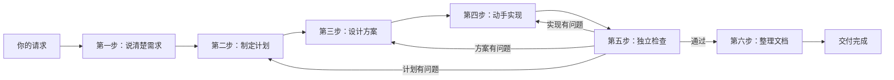

# 多智能体流水线

> 一个让 AI 助手像专业团队一样分工合作、完成复杂任务的工具。  
> 把一件复杂的事情拆成 **说清楚需求 → 制定计划 → 设计方案 → 动手实现 → 独立检查 → 整理文档** 六个步骤，每一步都留下记录。

<p align="center">
  <strong>不再靠 AI 一口气蒙着眼睛做完所有事，而是像流水线一样，每个环节各司其职，出了问题知道回哪里改。</strong>
</p>

---

## 目录

- [这个工具是干什么的](#这个工具是干什么的)
- [什么时候该用它](#什么时候该用它)
- [怎么启动它](#怎么启动它)
- [整体流程一览](#整体流程一览)
- [主要功能](#主要功能)
- [文件夹结构](#文件夹结构)
- [六个步骤各做什么](#六个步骤各做什么)
- [每步会产出什么文件](#每步会产出什么文件)
- [检查机制怎么运作](#检查机制怎么运作)
- [使用建议](#使用建议)
- [常见问题](#常见问题)

---

## 这个工具是干什么的

`multi-agent-pipeline` 是一套让 AI 助手完成复杂任务的工作流程。

它和直接让 AI 写代码不一样，更像是雇了一个**有分工的小团队**：

- 有人专门负责理解你的需求，写成清单。
- 有人负责制定计划、决定先做什么后做什么。
- 有人负责研究现有代码，决定怎么改动最合理。
- 有人负责真正动手实现。
- 有人负责独立检查，确认做得对不对。
- 有人负责整理文档，把这次改动记录下来。

每个人只做自己那一块，不会乱插手别人的工作。出了问题也能精准找到是哪个环节出了差错。

---

## 什么时候该用它

### 适合用

- 要做一个新功能，改动涉及好几个地方
- 需要对现有代码做比较大的调整
- 这次改动比较重要，希望有人独立检查一遍
- 你明确说了想用"流水线"或"多智能体"方式完成任务
- 希望每一步都有记录，方便以后回查

### 不适合用

- 改一个错别字
- 只改一个小地方
- 只是想问问题或者讨论思路
- 你只是想让 AI 快速帮你改一下，不需要这么严格的流程

---

## 怎么启动它

### 在 Claude Code 中用斜杠命令直接启动

```
/multi-agent-pipeline 给 API 加一个限速功能
```

```
/multi-agent-pipeline 把登录模块改造成支持第三方账号登录
```

```
/multi-agent-pipeline 做一个报表页面的 CSV 导出功能
```

### 用对话方式描述，AI 会自动判断是否启用

```
帮我做一个通知系统，当任务失败时自动发邮件和 Slack 提醒。
要求完整走完需求、设计和检查流程。
```

```
我需要一个经得起检查的分页搜索功能，请用多智能体流水线来做。
```

### 指定更严格的检查模式

```
/multi-agent-pipeline 给数据库加连接池——用严格检查模式（PRE）
```

### 从某个中间环节恢复（上次出错时）

```
上一次动手实现失败了，从方案设计环节重新来过。
```

---

## 整体流程一览


```mermaid
flowchart LR
    A[你的请求] --> B[第一步：说清楚需求]
    B --> C[第二步：制定计划]
    C --> D[第三步：设计方案]
    D --> E[第四步：动手实现]
    E --> F[第五步：独立检查]
    F -->|通过| G[第六步：整理文档]
    F -->|实现有问题| E
    F -->|方案有问题| D
    F -->|计划有问题| C
    G --> H[交付完成]
```

默认情况下，检查由**三个独立的 AI 分别进行**，然后按多数意见得出结论，避免单个 AI 的盲点。

---

## 主要功能

| 功能 | 说明 |
|---|---|
| 分步完成 | 把复杂任务拆成六个清晰的步骤，一步一步来 |
| 每步留记录 | 每个步骤完成后都保存一份结构化的记录文件 |
| 分工明确 | 主 AI 只负责协调，具体工作交给专门的 AI 去做 |
| 独立检查 | 支持严格单人检查（PRE）和三人独立检查投票（EME） |
| 出错自动回溯 | 检查不通过时，自动判断应该回到哪个步骤重做 |
| 记录全程 | 所有步骤的记录文件统一保存在 `.pipeline-workspace/` 文件夹 |
| 文档不落下 | 完成后自动更新相关文档和变更记录 |

---

## 文件夹结构

这个工具的说明文件都放在：

```text
multi-agent-pipeline/
├── SKILL.md                         # 工具的主要说明和流程
├── README.md                        # 你现在看的这份文档
├── agents/
│   ├── spec.md                      # 第一步：需求整理的说明
│   ├── plan.md                      # 第二步：制定计划的说明
│   ├── architecture.md              # 第三步：设计方案的说明
│   ├── execution.md                 # 第四步：动手实现的说明
│   ├── review.md                    # 第五步：独立检查的说明
│   └── doc.md                       # 第六步：整理文档的说明
└── references/
    ├── contracts.md                 # 每步记录文件的格式规范
    ├── pre-rubric.md                # 检查标准
    └── orchestrator-prompts.md      # 协调 AI 使用的模板
```

运行过程中，工具会自动创建一个工作记录文件夹：

```text
.pipeline-workspace/
├── spec.json            # 需求清单
├── plan.json            # 任务计划
├── architecture.json    # 方案设计
├── execution-report.json  # 实现报告
├── review_feedback.json   # 检查反馈
├── doc-report.json        # 文档更新记录
├── review_history/        # 每次检查的详细记录
└── logs/                  # 运行日志
```

---

## 六个步骤各做什么

### 第一步：说清楚需求

这一步负责把你的要求整理成一份清单，让后面的步骤不用猜测你想要什么。

整理的内容包括：

- 这个功能要做什么
- 必须满足哪些条件
- 什么情况算做好了
- 不能碰的范围
- 做了哪些合理的假设

### 第二步：制定计划

根据需求清单，制定具体的行动计划：先做什么、后做什么、哪些事有前后依赖关系、可能遇到什么风险。

这一步不负责决定怎么改代码，那是下一步的事。

### 第三步：设计方案

这一步会实际去读现有的代码，然后决定怎么改动最合理。

它会判断这次改动是：

- **小步增量**：在现有基础上加东西，改动小
- **结构调整**：需要对代码结构做比较大的重组
- **混合方式**：两种都有

然后给出具体要改哪些文件。

### 第四步：动手实现

按照第三步设计的方案，真正去修改代码。

它只改被授权修改的文件，不会乱动其他地方。完成后会写一份报告，说明改了什么、测试了什么、有没有遇到卡住的地方。

### 第五步：独立检查

从八个角度检查实现的结果：

1. **正确性** — 功能是否真的按要求实现了
2. **安全性** — 有没有引入安全漏洞
3. **性能** — 会不会让系统变慢
4. **错误处理** — 出错的时候处理得当不当
5. **代码质量** — 代码写得清不清晰、好不好维护
6. **方案一致性** — 实现和设计方案是否吻合
7. **测试覆盖** — 重要的情况有没有写测试
8. **向后兼容** — 有没有破坏现有功能

检查不通过时，会说明问题出在哪里，并决定应该回到第几步重做。

### 第六步：整理文档

检查通过后，更新需要变动的文档。

默认规则：
- 变更记录（CHANGELOG）每次都会更新
- 用户能看到的功能有变化时更新使用说明
- 接口有变化时更新技术文档

---

## 每步会产出什么文件

| 文件 | 哪一步产生 | 记录什么 |
|---|---|---|
| `spec.json` | 第一步 | 需求清单、验收条件、约束范围 |
| `plan.json` | 第二步 | 任务计划、执行顺序、依赖关系 |
| `architecture.json` | 第三步 | 代码分析结果、方案决策、目标文件列表 |
| `execution-report.json` | 第四步 | 改动记录、测试结果、遇到的问题 |
| `review_feedback.json` | 第五步 | 检查结论、问题描述、应回到哪步重做 |
| `doc-report.json` | 第六步 | 文档更新了哪些、为什么更新 |
| `review_history/` | 第五步 | 每个检查员的详细评分记录 |

这些文件的好处是：你可以随时回头看每一步为什么这么决定，出了问题也能快速定位是哪个环节的责任。

---

## 检查机制怎么运作

流水线有两种检查模式，默认用 EME。你可以根据任务的重要程度和复杂程度来选择。

### PRE 和 EME 有什么区别

| | PRE | EME |
|---|---|---|
| 全称 | Pointwise Rubric Evaluation | Ensembling Method Evaluation |
| 检查方式 | 一个 AI，把检查清单拆成一条一条逐项判断 | 多个 AI 同时独立检查，最后投票得出结论 |
| 严格程度 | 极严，任何一项不通过就打回重做 | 用多数意见聚合，单个 AI 的误判不会左右结果 |
| 适合场景 | 安全验证、合规要求、绝对不能出错的核心逻辑 | 复杂业务逻辑、算法实现、容易产生理解偏差的场景 |
| 资源消耗 | 较高（每条规则单独发送给 AI 判断） | 适中（多个 AI 并行，但每个只做一次完整判断） |

**如何理解这两种方式的本质差异：**

- **PRE** 的思路是"把尺子拆细"——把完整的检查清单分解成一个个单独的是非题，每次只让 AI 判断一件事，注意力高度集中，不会因为问题太多而漏掉任何一条。代价是极其严格，没有容错空间。
- **EME** 的思路是"让多个人来看"——同时派出多个 AI 分别评判，然后用投票来过滤掉单个 AI 可能犯的主观错误或偏见。适合那种"不同人可能有不同合理解读"的复杂情况。

### PRE：严格单人检查

一个检查员逐项核对八个维度的完整清单。任何一项不过关，整轮检查就不通过，并说明应该回到哪一步重做。适合对质量要求极高、不允许任何遗漏的改动。

### EME：三人独立检查（默认）

三个检查员分别独立检查，然后按维度投票，用多数意见得出结论。适合需要多个视角交叉验证、业务逻辑复杂的场景。

| 评分 | 含义 |
|---|---|
| 通过 | 没有发现问题 |
| 警告 | 有轻微问题，但不影响交付 |
| 不通过 | 有必须修复的问题 |

警告在投票中算通过，但会保留在反馈里，提醒你注意。

---

## 使用建议

### 描述需求时说清楚这几点

- 你想要实现什么
- 哪些行为必须满足
- 哪些地方不要动
- 是否需要测试和文档
- 有没有性能、安全或兼容性方面的要求

示例：

```text
用多智能体流水线实现导出 CSV 的功能。
要求：
- 不改变现有接口
- 数据量大时不能一次性加载全部数据
- 需要覆盖没有权限和没有数据的情况
- 通过检查后更新使用说明和变更记录
```

### 把不确定的事交给流水线去判断

除非遇到真正必须你来决定的问题，流水线会把低风险的不确定性记录为假设并继续推进，不会频繁打断你。

### 检查不通过不代表出了大问题

检查失败只是在告诉你问题出在哪一层，然后回去修：

- 实现写错了 → 回第四步重做
- 方案设计有问题 → 回第三步重做
- 计划拆分有问题 → 回第二步重做

---

## 常见问题

### 这是一个万能的 AI 框架吗？

不是。它是专门为 Claude Code 和 Codex 这类编程助手设计的工作流程，重点是把一件复杂的开发任务拆成可管理的步骤，并通过严格的检查保证质量。

### 为什么主 AI 不直接写代码？

让主 AI 只负责协调，可以避免它的工作内容越来越多，越来越难以管理。具体写代码的事由专门的 AI 来做，检查的事由另一个专门的 AI 来做，职责清晰。

### 为什么每步都要保存一份记录文件？

有了这些记录，每个步骤的输入和输出都是固定的、可以核查的。出了问题时，可以把上下文完整地传给上游步骤重做，不用从头来。

### 检查失败会一直循环下去吗？

不会。如果实现和检查之间连续失败两次，系统会强制回到方案设计步骤重新审视，而不是让实现步骤盲目反复修改。

### 文档一定会更新吗？

第六步会检查哪些文档需要更新，然后按规则只更新真正需要变动的部分。变更记录（CHANGELOG）每次都会更新。

---

## 一句话总结

`multi-agent-pipeline` 把复杂的开发任务变成一条有分工、有检查、有记录的流水线：先把需求说清楚，再计划，再设计，再实现，再检查，最后补齐文档。
